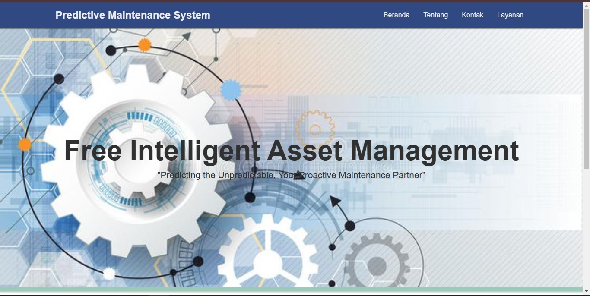
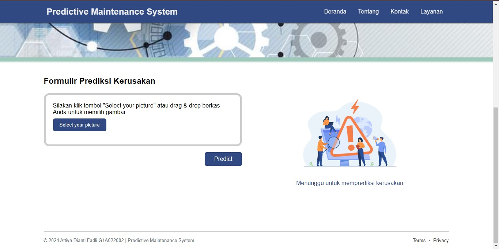

# FinalProject_G1A022002
## Final Project For Artificial Intelligence

Predictive Maintenance System dengan dukungan AI merupakan teknologi yang menawarkan pendekatan yang lebih efisien dan proaktif dalam pemeliharaan peralatan dibandingkan dengan metode tradisional. Sistem ini menekankan kemampuan sistem prediktif untuk menangani masalah yang tidak terduga, serta perannya sebagai mitra yang proaktif dalam pemeliharaan. Berikut Penerapan Predictive Maintenance System: 

## Beranda

Penjelasan singkat tentang gambaran umum proyek.

## Formulir Prediksi Kerusakan

Penjelasan singkat tentang gambaran umum proyek.
